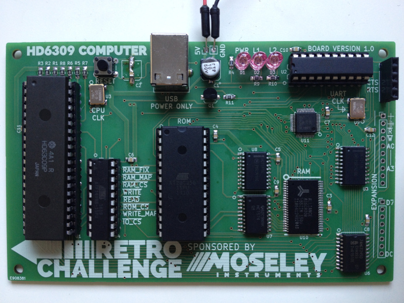
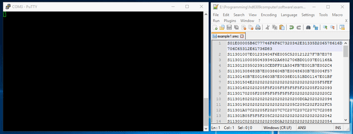

# HD6309-Computer
A computer based on the HD6309 CPU, done for the Retro Challenge 2017/04.

Read the blog: [https://namoseley.wordpress.com/category/retrochallenge/](https://namoseley.wordpress.com/category/retrochallenge/)

Features:
* HD6309 CPU
	* Binary compatible to MC6809
	* ..but faster instruction execution,
	* ..extended registers,
	* ..addition instructions,
	* and lots more!
* 1MB of RAM:
    * mapped in 32K pages at 0x0000 .. 0x7FFF
    * fixed page at 0x8000 .. 0xDFFF
* 2KB of IO space:
    * SC16C550B UART at 0xE000
    * 8-bit expansions port at 0xE010(untested!)
* Memory map register:
    * 5-bit entry sets A15..A19 on RAM
    * reg at address 0xE800
* 4KB of ROM:
    * Memory check
    * SREC loader

Licence: CERN Open Hardware Licence v1.2

Development time provided by: http://www.moseleyinstruments.com
